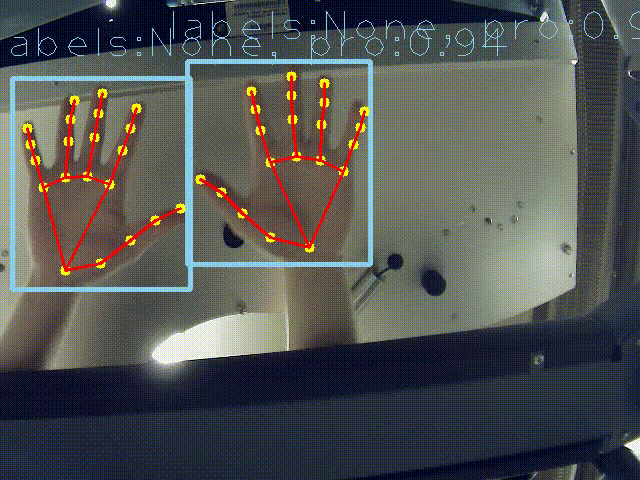

## Files Description
1. **augmentations.py**

- `image` is assumed to be a float tensor with shape [height, width, 3],
it is a RGB image with pixel values in range [0, 1].
`box` is a float tensor with shape [4].
`keypoints` is a float tensor with shape [num_landmarks, 2].

And you can see all the augmentation we applied here: ``src/input_pipline/augmentations.py``.

2. **gesture_landmark_labels_detector.py**
   - Implements a class `GestureLandmarkDetector` that loads a TensorFlow model and processes images to detect hand gestures. It returns detection boxes, confidence scores, and landmarks.

3. **Hand_tracking.pb**
   - A TensorFlow model file that contains the trained neural network for detecting hand gestures.

4. **testing.py**
   - A testing script that integrates video capture, gesture detection, and optional recording functionality. It demonstrates how the system can be used to interact with a robotic system based on real-time video input.

## Result of hand tracking

### The detection of 21 key points in each hand

